# Mars Habitat Automation Platform

## User Stories and System Overview

### 1. Introduction

In the year 2036, a fragile Mars habitat relies on a partially damaged automation system responsible for monitoring environmental conditions and controlling critical life-support infrastructure. 

The system must ingest heterogeneous sensor data coming from multiple devices that communicate using different protocols such as REST polling and streaming telemetry. The objective of this project is to rebuild a distributed automation platform capable of collecting sensor data, normalizing heterogeneous payloads into a unified internal event schema, evaluating automation rules in real time, triggering actuator responses when environmental conditions require intervention, and providing operators with a real-time monitoring dashboard. The platform follows an event-driven architecture where incoming sensor data flows through a message broker and is processed by backend services before being visualized in the frontend dashboard. 

The following user stories describe the functional requirements of the system. 

---

### 2.1 Dashboard and Monitoring

**USER STORIES FOR THE Mars Automation System** 

**US1** — As an Operator, I want to view a centralized dashboard displaying all habitat sensors so that I can monitor the overall health of the Mars habitat. 
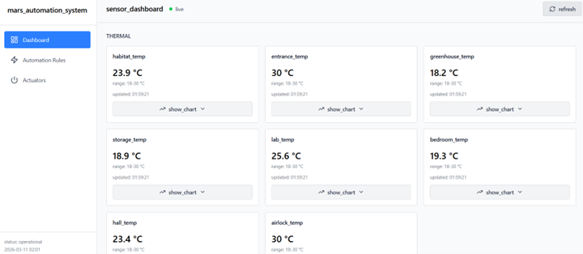

**US2** — As an Operator, I want to immediately see the most recent sensor reading when opening the dashboard so that I do not have to wait for the next data broadcast.  (LIVE UPDATE) 
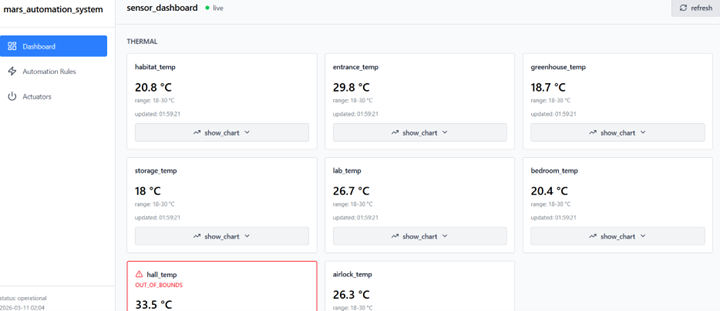

**US3** — As an Operator, I want sensor data to update automatically without refreshing the page so that I always see live telemetry information. 
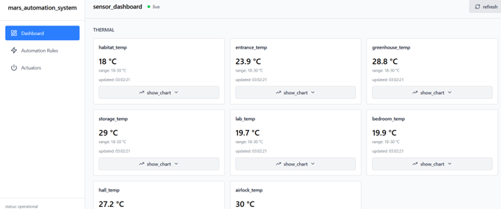
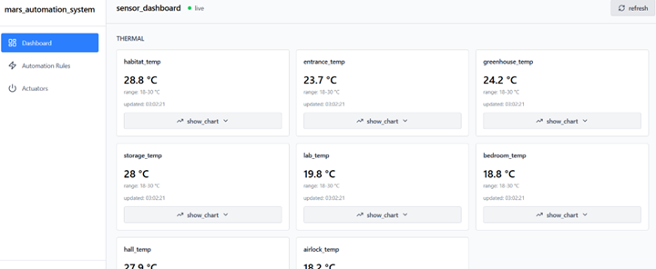

**US4** — As an Operator, I want all sensor data to be displayed using standardized units and naming conventions so that life‑support metrics are easy to interpret. 

**US5** — As an Operator, I want to visualize selected sensor data using live line charts so that I can monitor environmental trends over time. 
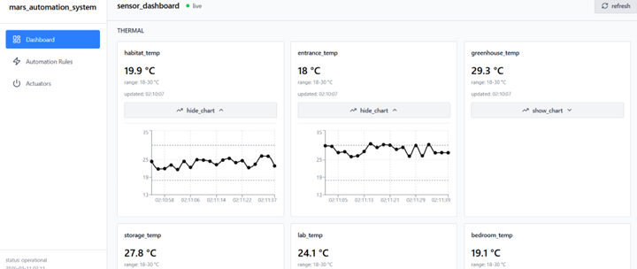
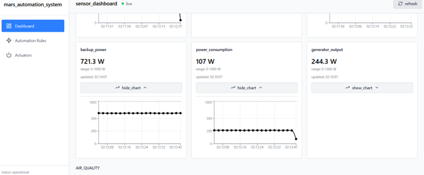

**US6** — As an Operator, I want sensors to be grouped by operational domain (Thermal, Power, Air Quality) so that related metrics are easier to locate. 

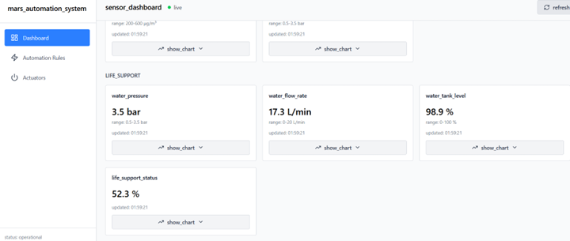

**US7** — As an Operator, I want the dashboard to display the timestamp of the most recent data received from each sensor so that I know if the sensor is active.( time stamp update live) 
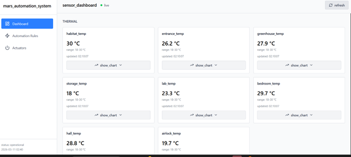

**US8** — As an Operator, I want a visual warning if sensor data is older than five minutes so that I do not rely on outdated telemetry. 

---

### 2.2 System Configuration and Actuator Monitoring

**US9** — As a Habitat Administrator, I want to configure the global polling frequency for REST-based sensors so that system performance and responsiveness can be balanced. 
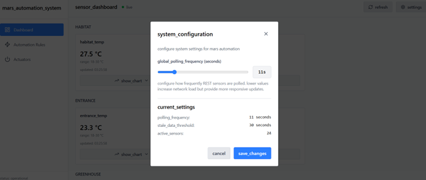

**US10** — As an Operator, I want to manually refresh actuator states from the dashboard so that I can verify their physical status immediately. 
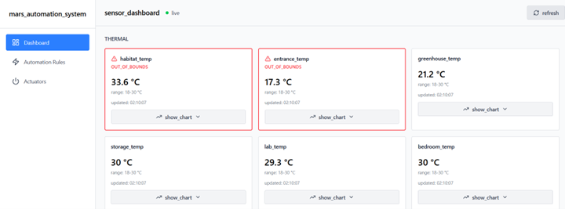

---

### 2.3 Automation Rule Management

**US11** — As an Automation Engineer, I want to create automation rules using a simple IF–THEN sentence format so that automation logic can be easily defined. 
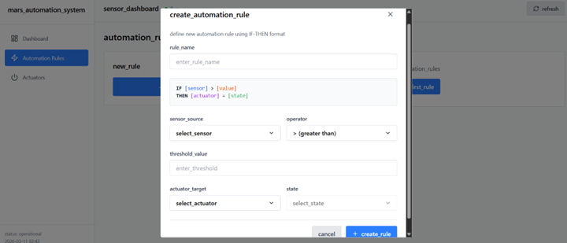

**US12** — As an Automation Engineer, I want sensors and actuators selectable from predefined lists so that typing errors are avoided. 
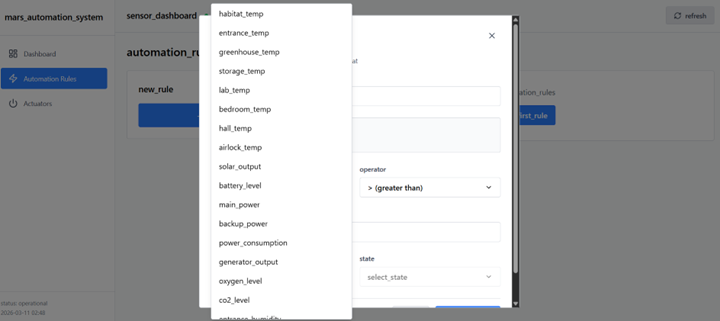

**US13** — As an Automation Engineer, I want rule conditions defined using mathematical operators (<, ≤, =, >, ≥) so that thresholds can be precise. 
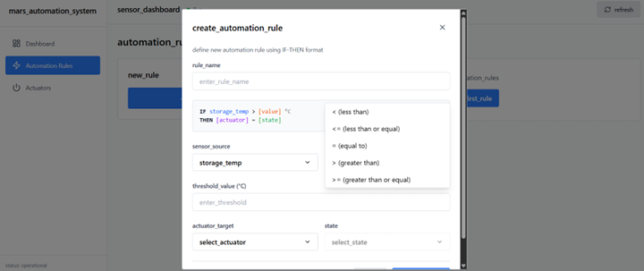

**US14** — As an Automation Engineer, I want to see a list of active rules so that the automation logic can be audited. 
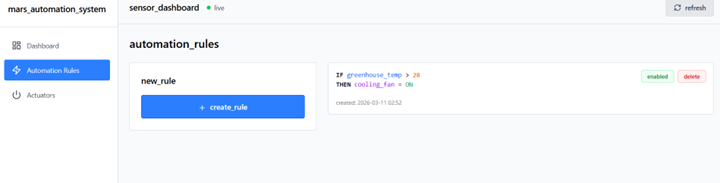

**US15** — As an Automation Engineer, I want to delete automation rules so that outdated or incorrect logic can be removed. 

**US16** — As an Automation Engineer, I want to edit existing rules so that thresholds can be adjusted when environmental conditions change. 
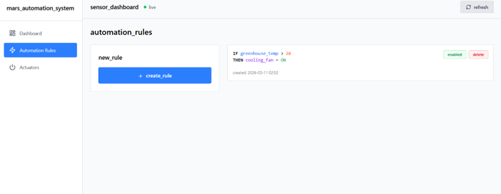

**US17** — As an Automation Engineer, I want to temporarily disable or enable rules so that maintenance activities do not trigger automation. 

---

### 2.4 System Resilience and Backend Reliability

**US18** — As a Habitat Administrator, I want automation rules to be stored persistently so that they survive system restarts. 
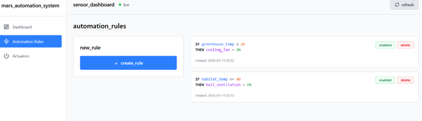

**US19** — As an Operator, I want the dashboard to display data from both streaming and polled sensors so that all habitat systems are visible in one interface. 
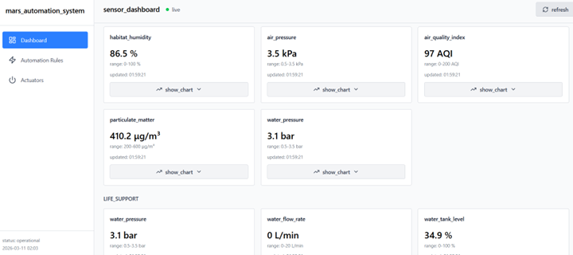

**US20** — As an Operator, I want rules evaluated immediately when new sensor data arrives so that actuators respond quickly to hazards. 
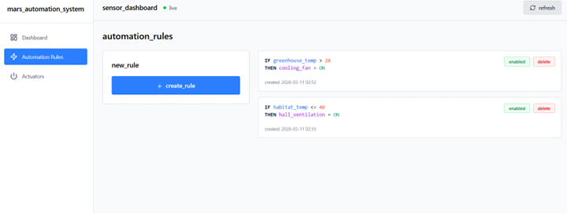
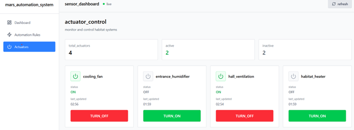

**US21** — As an Operator, I want the monitoring dashboard to remain responsive even if the rule engine fails so that monitoring continues. 
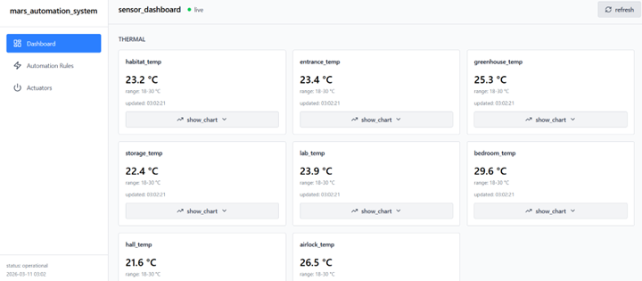

**US22** — As an Operator, I want visual alerts when sensor readings exceed safe ranges so that early warnings are provided. 
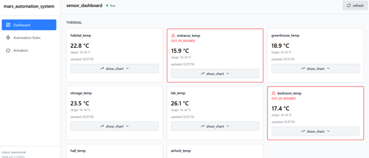

**US23** — As an Operator, I want a system connection indicator showing whether the UI is connected to backend services. 

**US24** — As an Operator, I want to be notified with a toast whenever an automated rule changes the state of an actuator, so that I know immediately what's going on in my habitat. 
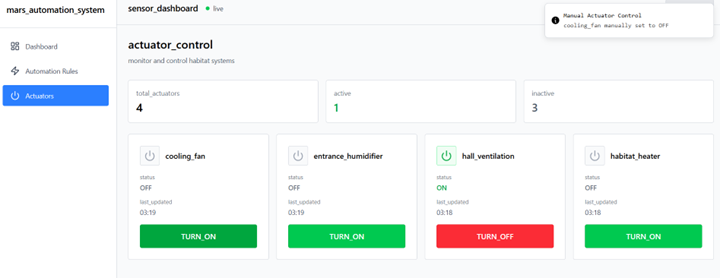
